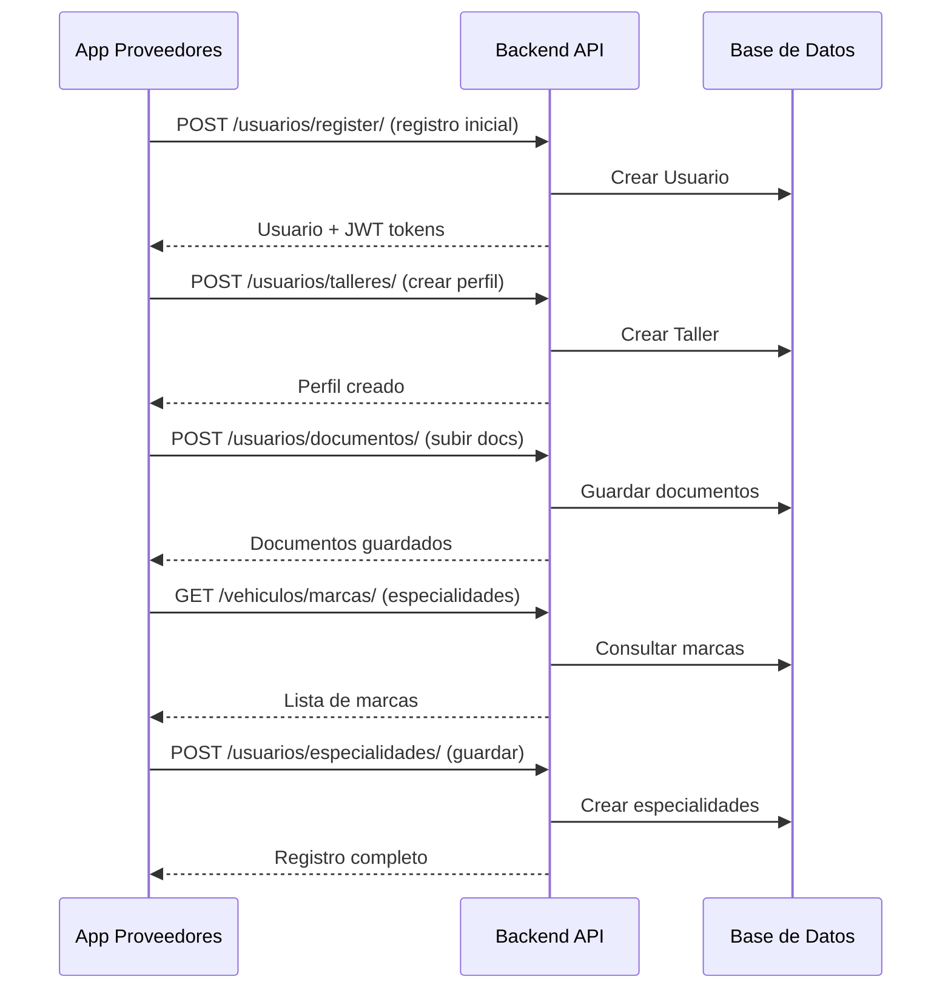

# 🔧 MecaniMóvil - Aplicación de Proveedores

## 📋 Descripción del Proyecto

La **MecaniMóvil App Proveedores** es una aplicación móvil desarrollada en React Native con Expo Router y TypeScript, diseñada específicamente para talleres mecánicos y mecánicos a domicilio que desean unirse a la plataforma MecaniMóvil para ofrecer sus servicios a clientes.

### 🔗 Conexión con el Ecosistema MecaniMóvil

Esta aplicación forma parte integral del ecosistema MecaniMóvil y se conecta con:

1. **MecaniMóvil Backend** (`mecanimovil-backend/`)
   - **Conexión**: APIs REST en `http://localhost:8000/api/`
   - **Función**: Registro de proveedores, validación de documentos, gestión de perfiles
   - **Datos compartidos**: Usuarios, talleres, mecánicos, especialidades, documentación

2. **MecaniMóvil App Usuarios** (`mecanimovil-frontend/mecanimovil-app/`)
   - **Conexión**: Indirecta a través del backend compartido
   - **Función**: Los proveedores registrados aquí aparecen disponibles para los clientes
   - **Sincronización**: Perfiles, servicios y disponibilidad en tiempo real

### 🎯 Objetivos de la Aplicación

- **Onboarding Completo**: Proceso guiado de registro paso a paso
- **Verificación Documental**: Subida y validación de documentos requeridos
- **Gestión de Perfiles**: Configuración detallada de talleres y mecánicos
- **Especialidades**: Selección de marcas y modelos de vehículos atendidos
- **Estado de Revisión**: Seguimiento del proceso de aprobación

---

## 🚀 Características Principales

### **Flujo de Registro Completo**

#### **1. Autenticación Inicial**
- **Registro de Usuario**: Formulario con nombre, correo, contraseña
- **Login**: Acceso para usuarios existentes
- **Conexión Backend**: `POST /api/usuarios/register/` y `POST /api/auth/token/`

#### **2. Selección de Tipo de Cuenta**
- **Taller Mecánico**: Para negocios establecidos con ubicación física
- **Mecánico a Domicilio**: Para profesionales que brindan servicios móviles
- **Navegación Adaptativa**: Formularios específicos según el tipo seleccionado

#### **3. Información Básica**
- **Datos del Negocio**: Formularios adaptativos según el tipo de cuenta
- **Ubicación Geoespacial**: Integración con servicios de ubicación
- **Descripción de Servicios**: Presentación del proveedor

#### **4. Documentación y Verificación**
- **Subida de Documentos**: Integración con Expo Image Picker
- **Fotos Requeridas**: Diferentes según el tipo de proveedor
- **Almacenamiento Seguro**: Expo Secure Store para datos sensibles

#### **5. Especialidades**
- **Marcas de Vehículos**: Selección múltiple de especialidades
- **Conexión con Catálogo**: Sincronización con base de datos del backend
- **Validación**: Verificación de especialidades seleccionadas

#### **6. Revisión y Confirmación**
- **Pantalla de Resumen**: Vista previa de toda la información
- **Estado de Proceso**: Indicador de progreso y estado de revisión
- **Notificaciones**: Alertas sobre el estado de aprobación

### **Tipos de Cuenta Detallados**

#### **Taller Mecánico**
**Información Requerida:**
- Nombre/Razón Social del Taller
- RUT/CUIT/ID Fiscal del negocio
- Dirección completa con geolocalización
- Descripción detallada de servicios
- Capacidad de atención diaria
- Horarios de funcionamiento

**Documentos Requeridos:**
- DNI/ID Personal del propietario (ambos lados)
- RUT/CUIT/ID Fiscal del negocio
- Fotos del taller (fachada, interior, equipos)
- Certificaciones (opcional)

**Endpoint Backend:** `POST /api/usuarios/talleres/`

#### **Mecánico a Domicilio**
**Información Requerida:**
- Nombre completo del mecánico
- DNI/RUT Personal
- Años de experiencia profesional
- Descripción de experiencia y especialidades
- Zona de cobertura geográfica
- Disponibilidad horaria

**Documentos Requeridos:**
- DNI/ID Personal (ambos lados)
- Licencia de conducir vigente
- Fotos de herramientas portátiles
- Foto de vehículo de trabajo (opcional)
- Certificaciones técnicas (opcional)

**Endpoint Backend:** `POST /api/usuarios/mecanicos-domicilio/`

---

## 🛠 Tecnologías Utilizadas

### **Stack Principal**

| Tecnología | Versión | Propósito | Conexión Backend |
|------------|---------|-----------|------------------|
| **React Native** | 0.81.5 | Framework móvil multiplataforma | - |
| **Expo** | ~54.0.31 | Plataforma de desarrollo y despliegue | - |
| **TypeScript** | ~5.9.2 | Tipado estático y mejor desarrollo | - |
| **Expo Router** | ~6.0.21 | Sistema de navegación basado en archivos | - |
| **Axios** | ^1.13.2 | Cliente HTTP para comunicación con APIs | ↔️ Django REST Framework |
| **Expo Secure Store** | ~15.0.8 | Almacenamiento seguro de tokens | JWT Tokens del Backend |
| **Expo Image Picker** | ~16.1.4 | Selección y captura de imágenes | ↔️ Media uploads Backend |
| **Expo Location** | ~18.1.5 | Servicios de geolocalización | ↔️ PostGIS Backend |

### **Librerías de UI/UX**

| Librería | Versión | Función |
|----------|---------|---------|
| **@expo/vector-icons** | ^14.1.0 | Iconografía |
| **expo-blur** | ~14.1.4 | Efectos visuales |
| **expo-haptics** | ~14.1.4 | Feedback táctil |
| **react-native-gesture-handler** | ~2.24.0 | Gestos avanzados |
| **react-native-reanimated** | ~3.17.4 | Animaciones fluidas |
| **react-native-safe-area-context** | 5.4.0 | Manejo de áreas seguras |

### **Herramientas de Desarrollo**

| Herramienta | Versión | Propósito |
|-------------|---------|-----------|
| **ESLint** | ^9.25.0 | Linting de código |
| **eslint-config-expo** | ~9.2.0 | Configuración ESLint para Expo |
| **@types/react** | ~19.0.10 | Tipados de React |

---

## 📁 Estructura del Proyecto

```
mecanimovil-app-proveedores/
├── package.json                     # Dependencias del proyecto
├── package-lock.json               # Lock de dependencias
├── app.json                        # Configuración de Expo
├── tsconfig.json                   # Configuración TypeScript
├── eslint.config.js                # Configuración ESLint
├── expo-env.d.ts                   # Tipos de entorno Expo
├── README.md                       # Documentación del proyecto
├── .gitignore                      # Archivos ignorados
├── app/                           # 📱 Aplicación principal (Expo Router)
│   ├── index.tsx                  # Pantalla inicial/router principal
│   ├── _layout.tsx                # Layout raíz de la aplicación
│   ├── +not-found.tsx             # Pantalla 404
│   ├── (auth)/                    # 🔐 Grupo de autenticación
│   │   ├── login.tsx              # Pantalla de login → POST /auth/token/
│   │   └── registro.tsx           # Registro inicial → POST /usuarios/register/
│   ├── (onboarding)/              # 🎯 Flujo de onboarding
│   │   ├── tipo-cuenta.tsx        # Selección: Taller vs Mecánico
│   │   ├── informacion-basica.tsx # Formularios específicos por tipo
│   │   ├── documentacion.tsx      # Subida de documentos → POST /documentos/
│   │   ├── especialidades.tsx     # Marcas de vehículos → GET /vehiculos/marcas/
│   │   └── revision.tsx           # Confirmación y estado de revisión
│   └── (tabs)/                    # 📋 Pantallas principales
│       └── home.tsx               # Dashboard principal (post-registro)
├── components/                     # ⚙️ Componentes reutilizables
│   ├── ui/                        # Componentes de interfaz
│   │   ├── Button.tsx             # Botón personalizado
│   │   ├── Input.tsx              # Input con validación
│   │   ├── Card.tsx               # Tarjetas de contenido
│   │   ├── LoadingSpinner.tsx     # Indicadores de carga
│   │   └── ImagePicker.tsx        # Selector de imágenes
│   ├── forms/                     # Formularios específicos
│   │   ├── TallerForm.tsx         # Formulario de taller
│   │   ├── MecanicoForm.tsx       # Formulario de mecánico
│   │   ├── DocumentUpload.tsx     # Subida de documentos
│   │   └── EspecialidadesSelect.tsx # Selector de especialidades
│   └── layout/                    # Componentes de layout
│       ├── SafeContainer.tsx      # Container con safe area
│       ├── KeyboardAvoidingContainer.tsx # Evita el teclado
│       └── ProgressIndicator.tsx  # Indicador de progreso
├── context/                       # 🔄 Contextos globales
│   ├── AuthContext.tsx            # Estado de autenticación
│   ├── OnboardingContext.tsx      # Estado del proceso de registro
│   └── UserProfileContext.tsx     # Perfil del proveedor
├── services/                      # 🌐 Servicios de comunicación
│   ├── api.ts                     # Cliente HTTP base → Backend
│   ├── auth.ts                    # Servicios de autenticación
│   ├── proveedores.ts             # APIs de registro de proveedores
│   ├── documentos.ts              # Subida y gestión de documentos
│   ├── vehiculos.ts               # Marcas y modelos de vehículos
│   └── upload.ts                  # Servicios de subida de archivos
├── hooks/                         # 🪝 Custom Hooks
│   ├── useAuth.ts                 # Hook de autenticación
│   ├── useImagePicker.ts          # Hook para selección de imágenes
│   ├── useLocation.ts             # Hook de geolocalización
│   └── useFormValidation.ts       # Hook de validación de formularios
├── constants/                     # 📋 Constantes globales
│   ├── Colors.ts                  # Paleta de colores
│   ├── Layout.ts                  # Constantes de layout
│   ├── Routes.ts                  # Nombres de rutas
│   └── Validations.ts             # Reglas de validación
├── assets/                        # 🎨 Recursos estáticos
│   ├── images/                    # Imágenes de la aplicación
│   ├── icons/                     # Iconos personalizados
│   └── fonts/                     # Fuentes tipográficas
├── scripts/                       # 🔧 Scripts de utilidad
│   └── reset-project.js           # Script de reset del proyecto
├── .expo/                         # Configuración de Expo
├── .vscode/                       # Configuración de VS Code
├── .git/                          # Control de versiones
└── node_modules/                  # Dependencias instaladas
```

---

## 🔗 Integración con Backend

### **Endpoints Principales Utilizados**

#### **Autenticación**
```typescript
// services/auth.ts
const authService = {
  // Registro inicial de usuario
  register: () => POST('/usuarios/register/'),
  
  // Login y obtención de tokens JWT
  login: () => POST('/auth/token/'),
  
  // Renovación de token
  refreshToken: () => POST('/auth/token/refresh/')
};
```

#### **Registro de Proveedores**
```typescript
// services/proveedores.ts
const proveedoresService = {
  // Crear perfil de taller
  crearTaller: () => POST('/usuarios/talleres/'),
  
  // Crear perfil de mecánico a domicilio
  crearMecanico: () => POST('/usuarios/mecanicos-domicilio/'),
  
  // Obtener perfil del proveedor
  obtenerPerfil: () => GET('/usuarios/perfil/'),
  
  // Actualizar información del proveedor
  actualizarPerfil: () => PUT('/usuarios/perfil/')
};
```

#### **Gestión de Documentos**
```typescript
// services/documentos.ts
const documentosService = {
  // Subir documento
  subirDocumento: () => POST('/usuarios/documentos/', FormData),
  
  // Obtener documentos del proveedor
  obtenerDocumentos: () => GET('/usuarios/documentos/'),
  
  // Eliminar documento
  eliminarDocumento: (id) => DELETE(`/usuarios/documentos/${id}/`)
};
```

#### **Especialidades y Vehículos**
```typescript
// services/vehiculos.ts
const vehiculosService = {
  // Obtener marcas de vehículos disponibles
  obtenerMarcas: () => GET('/vehiculos/marcas/'),
  
  // Obtener modelos por marca
  obtenerModelos: (marcaId) => GET(`/vehiculos/modelos/?marca=${marcaId}`),
  
  // Guardar especialidades del proveedor
  guardarEspecialidades: () => POST('/usuarios/especialidades/')
};
```

### **Flujo de Datos Frontend ↔ Backend**



---

## ⚙️ Configuración del Proyecto

### **Prerrequisitos**
- **Node.js** (v18 o superior)
- **npm** o **yarn**
- **Expo CLI** (`npm install -g @expo/cli`)
- **Dispositivo móvil** con Expo Go o **emulador**
- **Backend MecaniMóvil** ejecutándose en `http://localhost:8000`

### **Instalación**

```bash
# 1. Clonar el repositorio
git clone [url-del-repositorio]
cd mecanimovil-proveedores/mecanimovil-app-proveedores

# 2. Instalar dependencias
npm install

# 3. Configurar variables de entorno
# Crear archivo .env con:
EXPO_PUBLIC_API_BASE_URL=http://localhost:8000/api
EXPO_PUBLIC_ENV=development

# 4. Iniciar la aplicación
npx expo start

# 5. Opciones de ejecución
npx expo start --android    # Solo Android
npx expo start --ios        # Solo iOS
npx expo start --web        # Versión web
```

### **Configuración de la API**

```typescript
// services/api.ts
const BASE_URL = process.env.EXPO_PUBLIC_API_BASE_URL || 'http://localhost:8000/api';

// Para desarrollo en diferentes plataformas:
// Android Emulator: http://10.0.2.2:8000/api
// iOS Simulator: http://localhost:8000/api
// Dispositivo físico: http://[IP_DE_TU_COMPUTADORA]:8000/api
```

---

## 📱 Flujo de Usuario Detallado

### **1. Registro Inicial (auth/registro.tsx)**
```typescript
// Datos recolectados:
interface RegistroUsuario {
  nombre: string;
  apellido: string;
  email: string;
  password: string;
  confirmarPassword: string;
  telefono: string;
}

// Validaciones:
// - Email único en el sistema
// - Contraseña segura (8+ caracteres)
// - Teléfono en formato válido
// - Términos y condiciones aceptados
```

### **2. Selección de Tipo (onboarding/tipo-cuenta.tsx)**
```typescript
// Opciones disponibles:
type TipoCuenta = 'taller' | 'mecanico_domicilio';

// Navegación condicional:
// - Taller → informacion-basica.tsx (TallerForm)
// - Mecánico → informacion-basica.tsx (MecanicoForm)
```

### **3. Información Básica (onboarding/informacion-basica.tsx)**

#### **Para Taller**
```typescript
interface DatosTaller {
  nombre: string;
  rut_cuit: string;
  direccion: string;
  ubicacion: LatLng;
  descripcion: string;
  capacidad_diaria: number;
  horario_inicio: string;
  horario_fin: string;
  dias_atencion: string[];
}
```

#### **Para Mecánico a Domicilio**
```typescript
interface DatosMecanico {
  nombre_completo: string;
  dni_rut: string;
  años_experiencia: number;
  descripcion_experiencia: string;
  zona_cobertura: Polygon;
  disponibilidad_horaria: HorarioDisponibilidad[];
  vehiculo_trabajo: boolean;
}
```

### **4. Documentación (onboarding/documentacion.tsx)**
```typescript
// Documentos por tipo de proveedor:
interface DocumentosRequeridos {
  taller: [
    'dni_frente',
    'dni_dorso', 
    'rut_cuit',
    'foto_fachada',
    'foto_interior',
    'foto_equipos'
  ];
  mecanico: [
    'dni_frente',
    'dni_dorso',
    'licencia_conducir',
    'foto_herramientas',
    'foto_vehiculo'  // opcional
  ];
}

// Validaciones:
// - Formato de imagen válido (JPG, PNG)
// - Tamaño máximo 5MB por archivo
// - Calidad mínima de imagen
// - Documentos legibles
```

### **5. Especialidades (onboarding/especialidades.tsx)**
```typescript
// Estructura de especialidades:
interface Especialidad {
  marca_id: number;
  marca_nombre: string;
  modelos_seleccionados: number[];
  servicios_ofrecidos: string[];
}

// Flujo:
// 1. GET /vehiculos/marcas/ → Lista de marcas
// 2. Selección múltiple de marcas
// 3. GET /vehiculos/modelos/?marca=X → Modelos por marca
// 4. POST /usuarios/especialidades/ → Guardar selección
```

### **6. Revisión (onboarding/revision.tsx)**
```typescript
// Estados posibles:
type EstadoRevision = 
  | 'pendiente_revision'
  | 'en_revision'
  | 'aprobado'
  | 'rechazado'
  | 'requiere_documentos_adicionales';

// Información mostrada:
// - Resumen de datos ingresados
// - Estado actual del proceso
// - Tiempo estimado de revisión
// - Próximos pasos
```

---

## 🔐 Seguridad y Almacenamiento

### **Gestión de Tokens JWT**
```typescript
// hooks/useAuth.ts
import * as SecureStore from 'expo-secure-store';

const AuthHook = {
  // Almacenamiento seguro de tokens
  storeTokens: async (tokens: AuthTokens) => {
    await SecureStore.setItemAsync('access_token', tokens.access);
    await SecureStore.setItemAsync('refresh_token', tokens.refresh);
  },
  
  // Recuperación de tokens
  getTokens: async (): Promise<AuthTokens | null> => {
    const access = await SecureStore.getItemAsync('access_token');
    const refresh = await SecureStore.getItemAsync('refresh_token');
    return access && refresh ? { access, refresh } : null;
  },
  
  // Limpieza al logout
  clearTokens: async () => {
    await SecureStore.deleteItemAsync('access_token');
    await SecureStore.deleteItemAsync('refresh_token');
  }
};
```

### **Interceptores de API**
```typescript
// services/api.ts
// Interceptor para agregar tokens automáticamente
apiClient.interceptors.request.use(async (config) => {
  const tokens = await getTokens();
  if (tokens?.access) {
    config.headers.Authorization = `Bearer ${tokens.access}`;
  }
  return config;
});

// Interceptor para renovar tokens expirados
apiClient.interceptors.response.use(
  (response) => response,
  async (error) => {
    if (error.response?.status === 401) {
      const refreshed = await refreshToken();
      if (refreshed) {
        // Reintentar petición original
        return apiClient(error.config);
      } else {
        // Redirigir a login
        router.push('/login');
      }
    }
    return Promise.reject(error);
  }
);
```

### **Validación de Formularios**
```typescript
// hooks/useFormValidation.ts
const validationRules = {
  email: (value: string) => {
    const emailRegex = /^[^\s@]+@[^\s@]+\.[^\s@]+$/;
    return emailRegex.test(value) || 'Email inválido';
  },
  
  password: (value: string) => {
    return value.length >= 8 || 'Mínimo 8 caracteres';
  },
  
  rut_cuit: (value: string) => {
    // Validación específica por país
    return validateRutCuit(value) || 'RUT/CUIT inválido';
  },
  
  telefono: (value: string) => {
    const phoneRegex = /^[\+]?[1-9][\d]{8,14}$/;
    return phoneRegex.test(value) || 'Teléfono inválido';
  }
};
```

---

## 🎨 Diseño y UX

### **Sistema de Colores**
```typescript
// constants/Colors.ts
export const Colors = {
  primary: '#2A4065',      // Azul principal MecaniMóvil
  secondary: '#46B5E8',    // Azul secundario
  accent: '#F5A623',       // Naranja de acento
  background: '#F8F9FA',   // Fondo principal
  surface: '#FFFFFF',      // Superficie de cards
  text: '#333333',         // Texto principal
  textSecondary: '#666666', // Texto secundario
  success: '#28A745',      // Verde de éxito
  warning: '#FFC107',      // Amarillo de advertencia
  error: '#DC3545',        // Rojo de error
  border: '#E9ECEF',       // Bordes
};
```

### **Componentes Reutilizables**
```typescript
// components/ui/Button.tsx
interface ButtonProps {
  title: string;
  onPress: () => void;
  variant?: 'primary' | 'secondary' | 'outline' | 'ghost';
  size?: 'small' | 'medium' | 'large';
  loading?: boolean;
  disabled?: boolean;
  icon?: string;
}

// components/ui/Input.tsx
interface InputProps {
  label: string;
  placeholder?: string;
  value: string;
  onChangeText: (text: string) => void;
  error?: string;
  secureTextEntry?: boolean;
  keyboardType?: KeyboardTypeOptions;
  multiline?: boolean;
  icon?: string;
}
```

### **Navegación con Expo Router**
```typescript
// app/_layout.tsx
export default function RootLayout() {
  return (
    <AuthProvider>
      <OnboardingProvider>
        <Stack screenOptions={{ headerShown: false }}>
          <Stack.Screen name="index" />
          <Stack.Screen name="(auth)" />
          <Stack.Screen name="(onboarding)" />
          <Stack.Screen name="(tabs)" />
        </Stack>
      </OnboardingProvider>
    </AuthProvider>
  );
}
```

---

## 🧪 Testing y Calidad

### **Comandos de Desarrollo**
```bash
# Linting de código
npm run lint

# Verificar tipado TypeScript
npx tsc --noEmit

# Reset del proyecto (limpiar cache)
npm run reset-project

# Debugging con Flipper
npx expo start --dev-client

# Análisis de bundle
npx expo export --dump-assetmap
```

### **Estructura de Testing**
```typescript
// __tests__/components/Button.test.tsx
import { render, fireEvent } from '@testing-library/react-native';
import Button from '../../components/ui/Button';

describe('Button Component', () => {
  it('renders correctly', () => {
    const { getByText } = render(
      <Button title="Test Button" onPress={() => {}} />
    );
    expect(getByText('Test Button')).toBeTruthy();
  });
  
  it('handles press events', () => {
    const mockPress = jest.fn();
    const { getByText } = render(
      <Button title="Test Button" onPress={mockPress} />
    );
    fireEvent.press(getByText('Test Button'));
    expect(mockPress).toHaveBeenCalled();
  });
});
```

---

## 🚀 Próximas Funcionalidades

### **Fase 2 - Dashboard de Proveedor**
- [ ] Gestión de solicitudes recibidas
- [ ] Configuración de horarios y disponibilidad
- [ ] Actualización de precios de servicios
- [ ] Chat con clientes
- [ ] Sistema de calificaciones

### **Fase 3 - Funcionalidades Avanzadas**
- [ ] Notificaciones push en tiempo real
- [ ] Análisis de performance y estadísticas
- [ ] Sistema de promociones
- [ ] Integración con sistemas de pago
- [ ] Reportes de ingresos

### **Fase 4 - Optimizaciones**
- [ ] Modo offline para formularios
- [ ] Sincronización automática
- [ ] Optimización de imágenes
- [ ] Cache inteligente
- [ ] Performance monitoring

---

## 🐛 Solución de Problemas

### **Problemas Comunes y Soluciones**

#### **1. Error de conexión con backend**
```bash
# Verificar que el backend esté ejecutándose
curl http://localhost:8000/api/

# Para dispositivo físico, usar IP de la computadora
EXPO_PUBLIC_API_BASE_URL=http://192.168.1.100:8000/api
```

#### **2. Problemas con permisos de cámara/galería**
```typescript
// Verificar permisos en app.json
{
  "expo": {
    "plugins": [
      [
        "expo-image-picker",
        {
          "photosPermission": "La aplicación accede a tus fotos para subir documentos."
        }
      ]
    ]
  }
}
```

#### **3. Errores de navegación con Expo Router**
```typescript
// Verificar estructura de archivos en app/
// Usar router.push() en lugar de navigation.navigate()
import { router } from 'expo-router';
router.push('/onboarding/tipo-cuenta');
```

#### **4. Problemas de tipado TypeScript**
```bash
# Regenerar tipos de Expo
npx expo customize tsconfig.json

# Verificar configuración
npx tsc --noEmit
```

---

## 📞 Soporte y Documentación

### **Recursos Adicionales**
- **Documentación Expo Router**: [https://expo.github.io/router/docs/](https://expo.github.io/router/docs/)
- **TypeScript con React Native**: [https://reactnative.dev/docs/typescript](https://reactnative.dev/docs/typescript)
- **Expo Secure Store**: [https://docs.expo.dev/versions/latest/sdk/securestore/](https://docs.expo.dev/versions/latest/sdk/securestore/)
- **Backend API**: Ver `mecanimovil-backend/README.md`

### **Contacto de Desarrollo**
- **Repositorio**: [GitHub Repository]
- **Issues**: Reportar en GitHub Issues
- **Documentación Backend**: `mecanimovil-backend/README.md`
- **App Usuarios**: `mecanimovil-frontend/mecanimovil-app/docs/`
- **Email**: desarrollo@mecanimovil.com

### **Enlaces del Ecosistema**
- **Backend MecaniMóvil**: `mecanimovil-backend/`
- **App Usuarios**: `mecanimovil-frontend/mecanimovil-app/`
- **Documentación Completa**: Ver archivos README de cada proyecto

---

## 📄 Licencia

Este proyecto es parte del sistema MecaniMóvil y está sujeto a los términos y condiciones de la empresa. Para uso comercial, contactar al equipo de desarrollo.

**© 2024 MecaniMóvil - Todos los derechos reservados**
